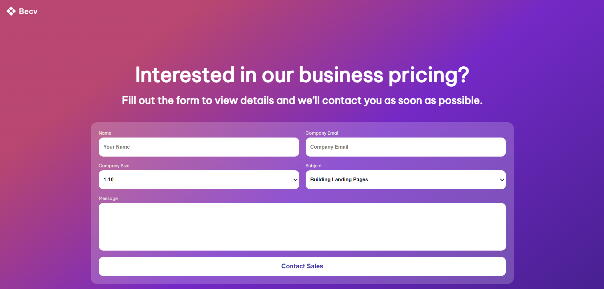
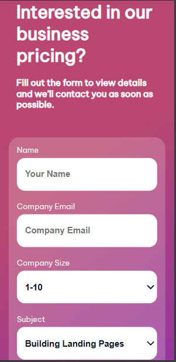

<h1 align="center">Contact Page</h1>

   Solution for a challenge <a href= "https://bytesteban.github.io/Contact-Page-Form/" target="_blank">Contact Page</a> from <a href="http://devchallenges.io" target="_blank">devChallenges.io</a>.

  <h3>
    <a href="https://bytesteban.github.io/Contact-Page-Form/">
      Solution Here
    </a>
     | 
    <a href="https://devchallenges.io/challenge/business-blog-card">
      Challenge Here
    </a>
  </h3>

<!-- TABLE OF CONTENTS -->

## Table of Contents

- [Overview](#overview)
  - [What I learned](#what-i-learned)
- [Built with](#built-with)
- [Features](#features)
- [Contact](#contact)

<!-- OVERVIEW -->

## Overview

### What I learned

In this project, I focused on mastering CSS Grid to create a non-linear, staggered layout for the testimonial cards. I also deepened my understanding of the Flexbox model to manage internal component alignment and ensure a consistent UI across different screen sizes.

### Built with

- Semantic HTML5 markup
- CSS custom properties
- Flexbox

## Features

This application/site was created as a submission to a [DevChallenges](https://devchallenges.io/challenges-dashboard) challenge.

## Author

- Linkedin [Esteban Padilla](https://www.linkedin.com/in/esteban-padilla-834b79325)
- GitHub [@ByteSteban](https://github.com/ByteSteban)
